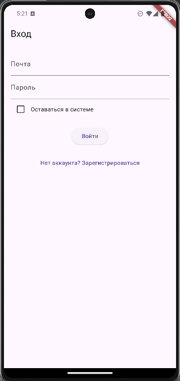

# Установка приложения

Следуйте этим шагам, чтобы установить приложение на свое устройство:

1. Загрузите приложение из [Google Play](https://play.google.com/) или [App Store](https://www.apple.com/app-store/).
2. Установите приложение на устройство.
3. Откройте приложение и зарегистрируйтесь.

## Минимальные требования
- **Android**: версия 7.0 или выше.
- **iOS**: версия 12.0 или выше.

