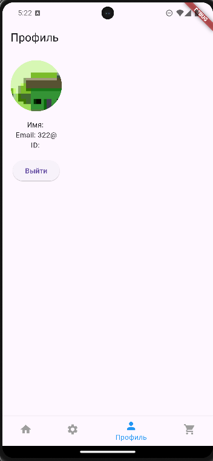

# Управление аккаунтом

Чтобы создать или настроить аккаунт:
1. Перейдите в раздел **Аккаунт**.
2. Нажмите "Зарегистрироваться" или войдите в существующий аккаунт.
3. Настройте свой профиль.

[]

Перейдите к [руководству по корзине](./user_guide/cart_management.md).
