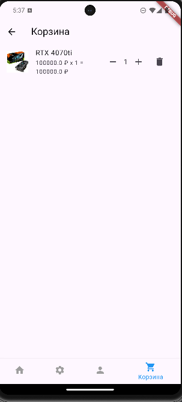

# Управление корзиной

## Функционал корзины:
- Добавление товара в корзину.
- Увеличение/уменьшение количества товаров.
- Удаление товаров.

### Пример работы с корзиной:
1. Нажмите на кнопку **Добавить в корзину**.
2. Перейдите в раздел "Корзина".
3. Управляйте товарами через кнопки + и -.

